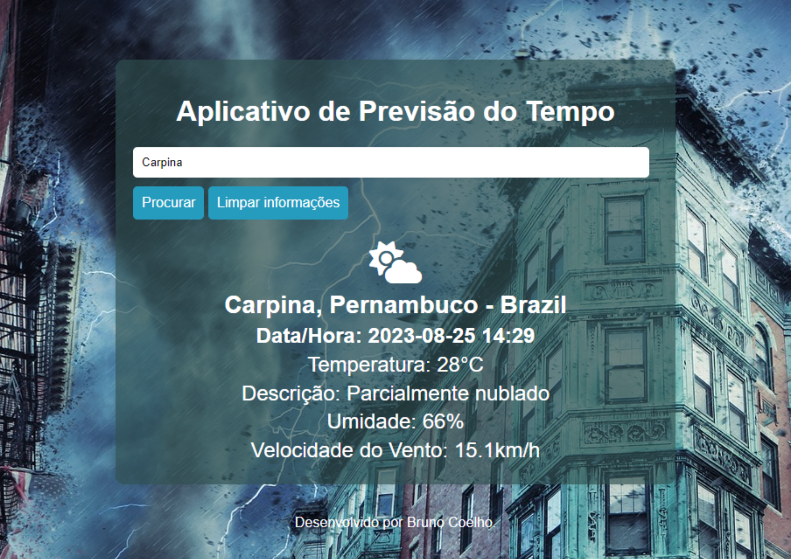

# Aplicativo de Previsão do Tempo
## Aplicação com consumo de API

## Tecnologias Utilizadas
- HTML
- CSS
- JAVASCRIPT
- GIT

## Funcionalidades
- [x] Aba de pesquisa por nome de cidades
- [x] Botões interativos
- [x] Visualização de resultado da pesquisa

## Layout

## Demonstração
[Previsao do Tempo](https://bminority.github.io/previsao_do_tempo/)

## Desenvolvido por
Bruno Coelho [Linkedin](www.linkedin.com/in/bruno-coelho-97b630220)